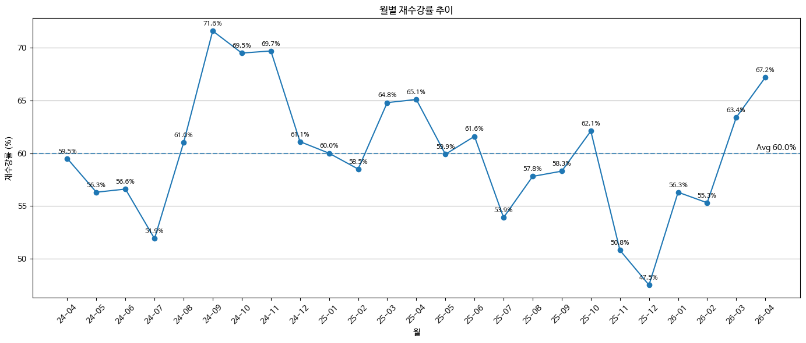
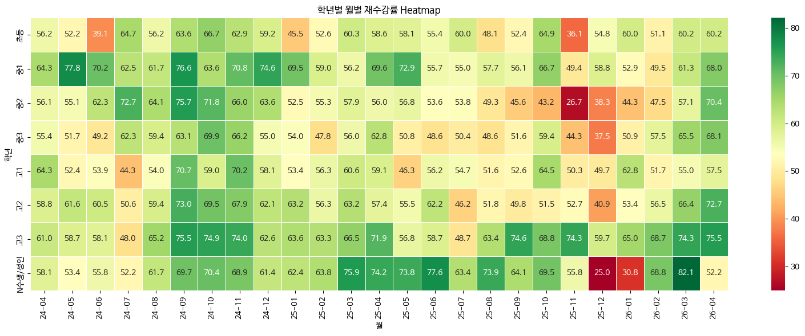
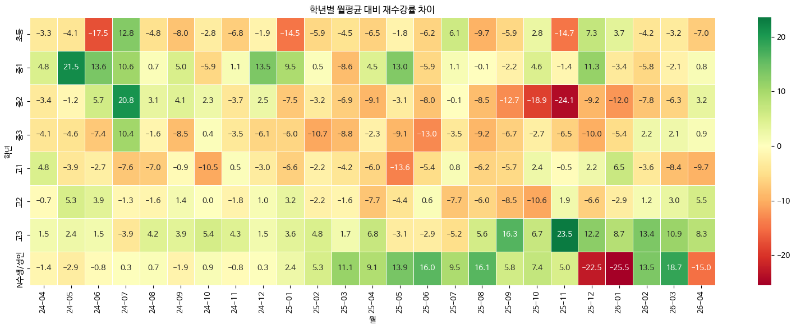
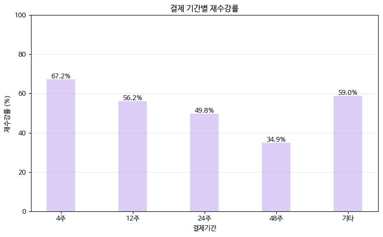
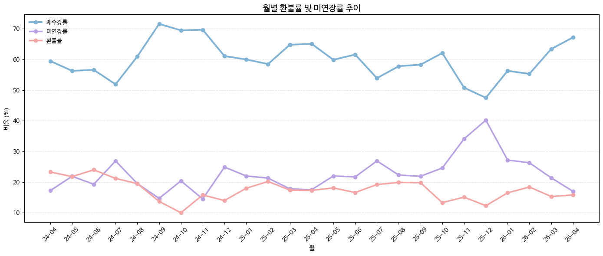

# 📊 Retention Rate Analysis
운영 데이터를 활용하여 재수강률 변동 요인을 분석하고,  
데이터 기반 운영 의사결정을 지원하기 위한 EDA 프로젝트입니다.

---

## 📌 Background
온라인 교육 서비스에서는 재수강률(Retention Rate)을 주요 운영 KPI로 관리하고 있습니다.

재수강률 변동 원인을 설명할 수 있는 데이터 기반 분석이 충분하지 않았습니다.  
또한 변동이 특정 시기나 단일 요인에 의해 발생하는지 명확하게 확인된 적도 없었습니다.

이에 실제 운영 데이터를 활용하여 재수강률 변동 요인을 다양한 관점에서 분석하고,  
운영 개선을 위한 데이터 기반 인사이트를 도출하고자 하였습니다.

---

## 🎯 Goal
- 월별 재수강률 추이 및 변동 패턴 확인
- 학년별 재수강률 차이 분석
- 결제 기간별 재수강률 차이 분석
- 이탈 유형(환불 / 미연장) 분석
- 운영 개선을 위한 데이터 기반 인사이트 도출

---

## 🛠 Tech Stack
- Python
- Pandas
- Matplotlib
- Seaborn
- Google Colab

---

## 📅 Dataset

### Analysis Period
- 2024.04 ~ 2026.04

### Data Source
- 계산일 기준 운영 데이터

### Data Preprocessing

- 수학 정규 프로그램 데이터만 사용
- 개강 전 환불 및 분석 제외 계약 상태 제거
- 분석 제외 상품 제거
- 계약 상태 표준화 (연장완료 / 환불 / 미연장)
- 계산일 기준 월 컬럼 생성
- 데이터 안정화 이전(24-03) 및 미완료 월(26-05~) 제외

---

## 📈 Analysis

### Analysis 1. 월별 재수강률 추이

- 전체 평균 재수강률은 약 60% 수준
- 특정 시기에 재수강률 하락 구간 존재
- 연도별 패턴은 일관되지 않음
- 단순 계절성 외 추가 요인 존재 가능성 확인

### Analysis 2. 학년별 월별 재수강률 추이

- 대부분의 학년이 전체 재수강률과 유사한 추이를 보임
- 일부 학년에서 일시적 변동 존재
- 학년 변수만으로 재수강률 변동 설명 어려움

### Analysis 3. 결제 기간별 재수강률

- 결제 기간이 길어질수록 재수강률 감소
- 학년보다 결제 기간에서 상대적으로 큰 차이 확인
- 계약 기간 특성의 영향이 함께 반영되었을 가능성 존재

### Analysis 4. 월별 환불률 및 미연장률 추이

- 재수강률 하락 시기에는 환불보다 미연장률 증가가 두드러짐
- 환불률은 비교적 안정적인 수준 유지
- 재수강률 변동은 환불보다 미연장률 변화와 높은 연관성 확인

---

## 💡 Key Findings

- 재수강률은 단순 계절성만으로 설명되지 않음
- 학년별 차이는 일부 존재하지만 일관되지 않음
- 결제 기간은 재수강률과 유의미한 차이를 보임
- 재수강률 하락은 환불보다 미연장 증가와 더 높은 연관성을 보임
- 재수강률 변동은 단일 변수보다 다양한 요인이 복합적으로 작용하는 것으로 확인됨
- 팀별 상황을 고려한 운영 전략 수립의 필요성 확인

---

## 📌 Business Impact

- 재수강률 변동을 다양한 관점에서 해석할 수 있는 근거 마련
- 운영 현황을 데이터 기반으로 점검하고 운영 개선 방향을 검토할 수 있는 인사이트 도출
- 동일한 KPI를 다양한 관점에서 분석하는 EDA 프로세스 구축

---

## 🔒 Note

- 실제 운영 데이터를 기반으로 수행한 프로젝트입니다.
- 원본 데이터는 공개하지 않았습니다.
- 개인정보 및 회사 식별 정보는 모두 제거 또는 비식별 처리하였습니다.
